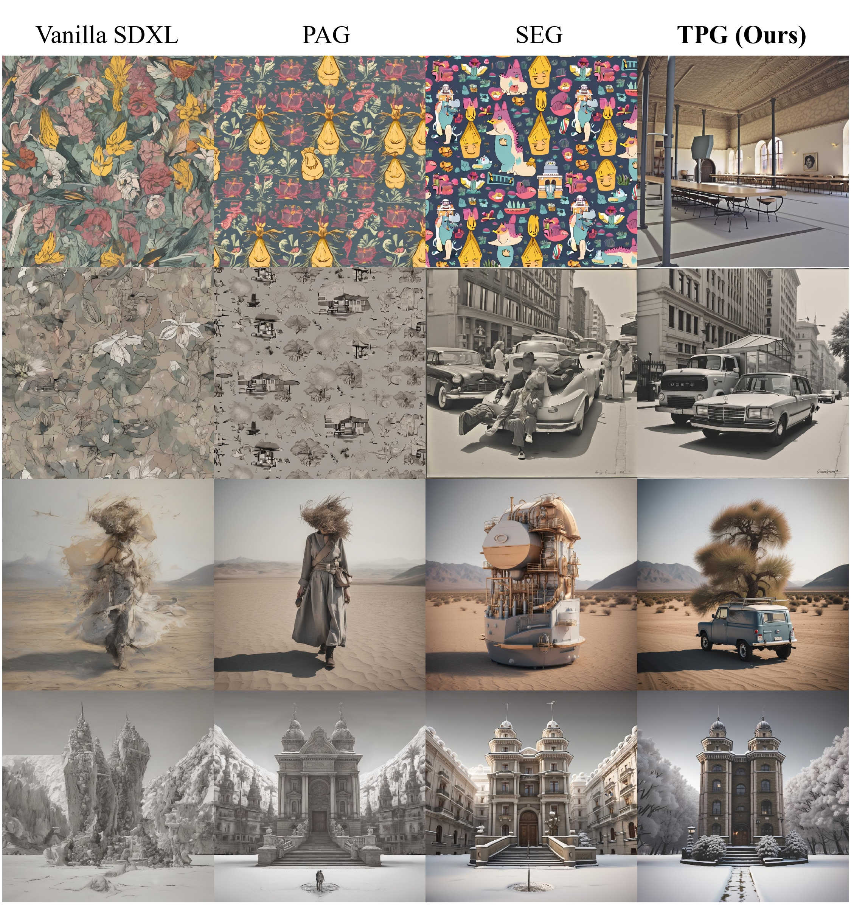

# Token-Perturbation-Guidance
<a href="https://arxiv.org/abs/2506.10036"></a>

Official implementation of "Token Perturbation Guidance for Diffusion Models"

>This paper proposes Token Perturbation Guidance (TPG), a simple yet effective method based on token shuffling for extending the benefits of classifier-free guidance to broader settings, including unconditional generation. Compared to existing perturbation-based guidance methods, TPG achieves better quality and prompt alignment, making it a simple plug-and-play module to improve the quality of diffusion models.



## Get started

This is an example of a Python script:
```python
from pipeline_tpg import StableDiffusionXLTPGPipeline
pipe = StableDiffusionXLTPGPipeline.from_pretrained(
    "stabilityai/stable-diffusion-xl-base-1.0",
    torch_dtype=torch.float16
)

device = "cuda"
pipe = pipe.to(device)
prompts = [""]
seed = 0

generator = torch.Generator(device="cuda").manual_seed(seed)
output = pipe(
    prompts,
    guidance_scale=0.0,
    tpg_scale=3.0,
    generator=generator,
).images
```

## Citation 

If you find TPG is useful or relevant to your research, please kindly cite our work:

```bib
@article{rajabi2025token,
  title={Token Perturbation Guidance for Diffusion Models},
  author={Rajabi, Javad and Mehraban, Soroush and Sadat, Seyedmorteza and Taati, Babak},
  journal={arXiv preprint arXiv:2506.10036},
  year={2025}
}
```
